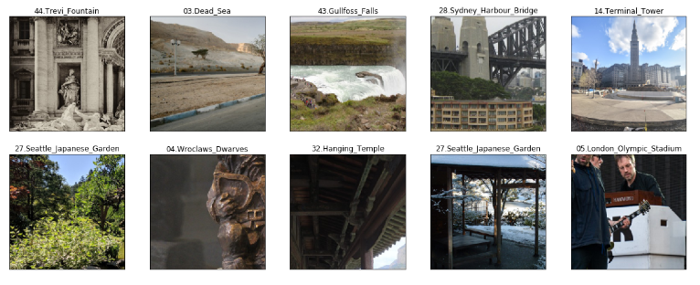
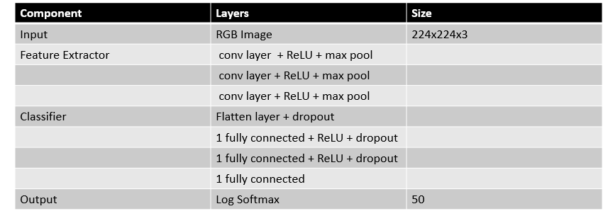
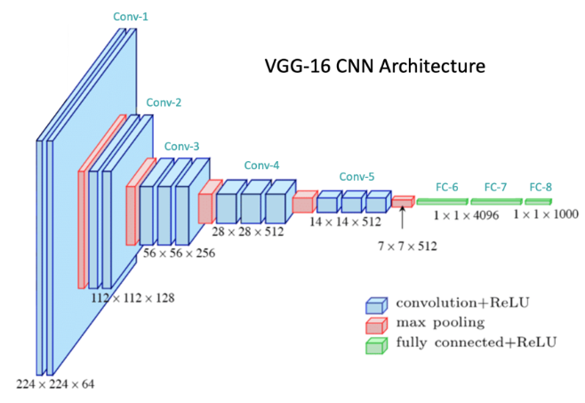
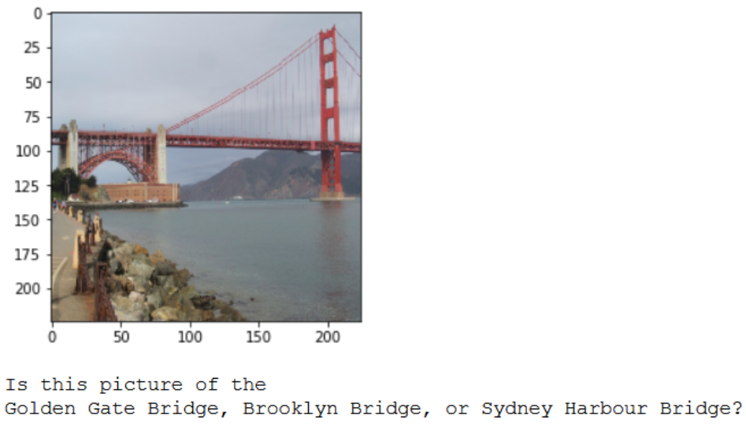

## Landmark Classification 

Photo sharing and photo storage services like to have location data for each photo that is uploaded. With the location data, these services can build advanced features, such as automatic suggestion of relevant tags or automatic photo organization, which help provide a compelling user experience. Although a photo's location can often be obtained by looking at the photo's metadata, many photos uploaded to these services will not have location metadata available. This can happen when, for example, the camera capturing the picture does not have GPS or if a photo's metadata is scrubbed due to privacy concerns.

If no location metadata for an image is available, one way to infer the location is to detect and classify a discernable landmark in the image. Given the large number of landmarks across the world and the immense volume of images that are uploaded to photo sharing services, using human judgement to classify these landmarks would not be feasible.

**Use Case:**
<figure>
 
 <figcaption>
 

 
 
 Use Case. 
 
 </figcaption>
</figure>
 

The goal of this project is to write a landmark classifier. Therefore two approaches are taken:
1) Build an own classifier
2) Transfer Learning: Take a pre-trained net and retrain it for the use case.

The Project Overview
---

Following steps are taken:

0) Data Visualization
1) Create a CNN to Classify Landmarks (from Scratch)
2) Create a CNN to Classify Landmarks (using Transfer Learning)
3) Landmark Prediction Algorithm

# Function Development
## 0) Data Visualization
**Input Data**
CNNs in this project are trained using a dataset of landmark images provided by Udacity [3]. This dataset contains about 6000 images divided into 50 categories. Image category ID/names are stored in file categories.json.

Note that the dataset used in this project is a subset of the Google Landmark Dataset v2 [4].

<figure>
 
 <figcaption>
 

 
 
 Example data visualisation. 
 
 </figcaption>
</figure>
 

 
### 1) Create a CNN to Classify Landmarks (from Scratch)
The goal is to reach at least a 20% accurancy for the training. There for a first shot is taken to do a minimal data preparation and a minimal net to aichve this objection.

 **Prepare Data**
70% of the date are used for the training data, 10% are use to test and 20% for the validation.

The net is created to take in a 224x224 pixel img. Therefore the input images get random croped to 224x224pixels, transformed to a tensor and then nomalized. 

**Net**
Inspired by the VGG16 net a simplfyed net is created. With this configuration a 22% accurancy is reached. Slightly above the requirment. 

<figure>
 
 <figcaption>
 

 
 
 Net created from scratch. 
 
 </figcaption>
</figure>
 

### 2) CNN from Transfer Learning
Used is a pretrained ConvNet model, the VGG16. Its developed for object detecion and classificatin. It is cosidered to be one of the best computer vison models to date[1]. As first net it used small (3x3) convolutinal filter and push the depth to 16 weight layer.

Usage: To adapt the net to the use case the classifier, last fully connected layers is replaced by a 50 wide net to detecte the requried 50 classes. And then retrained. 

<figure>
 
 <figcaption>
 

 
 
 Example data visualisation. 
 
 </figcaption>
</figure>
 

### Trained
| Parameter         | Method        | Value/Function  |
| -------------     |:-------------:| -----:|
| **Error function**| Cross-Entropy |nn.CrossEntropyLoss() |
| **Metrics**       | centered      |   $12 |
| **Batching**      | are neat      |    $1 |
| **Optimizer**     | are neat      |    $1 |
| **Epochs**        | are neat      |    $1 |
| **Learning rate** | are neat      |    $1 |

Cross-Entropy loss is a most important cost function. It is used to optimize classification models. The understanding of Cross-Entropy is pegged on understanding of Softmax activation function [3]. 
### Trained
Test accurancy is 

### 3) Algorithm implementation with trained net

An algorithm is develop the takes in a random image and predicts the 3 most likely location. 
<figure>
 
 <figcaption>
 

 
 
 Example data visualisation. 
 
 </figcaption>
</figure>
 

## Discussion
Improvements:
Two possible easy ways to make the pipeline more robust:
1) Train the Net longer to get an higher accurancy 

2) Improving the quality of the written SW so that it can be used in producation.   

 ### Appendix
 #### References
 [1] https://medium.com/@mygreatlearning/everything-you-need-to-know-about-vgg16-7315defb5918
 [2] VGG16. VERY DEEP CONVOLUTIONAL NETWORKS FOR LARGE-SCALE IMAGE RECOGNITION (https://arxiv.org/pdf/1409.1556.pdf)
 [3]Cross-Entropy Loss https://towardsdatascience.com/cross-entropy-loss-function-f38c4ec8643e

 

